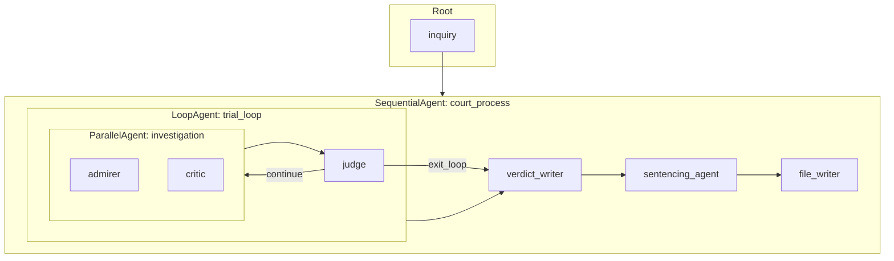
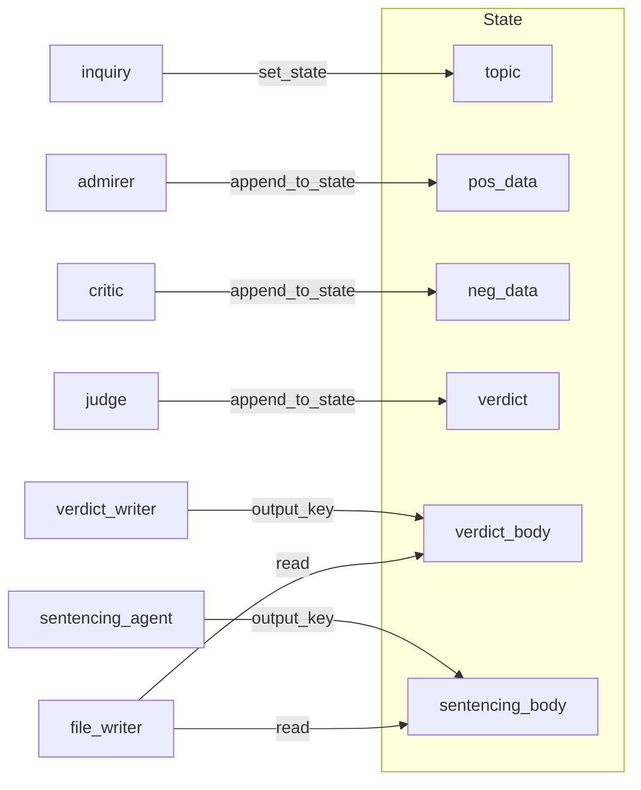

# The Historical Court

ระบบจำลองศาลอาญาระหว่างประเทศแบบ Multi-Agent สร้างด้วย Google ADK — ประเมินบุคคลหรือเหตุการณ์ทางประวัติศาสตร์ผ่านการสืบสวนแบบขัดแย้ง การพิจารณาของตุลาการ และสร้างรายงานกฎหมายแบบ A4


---

## ภาพรวมระบบ

ระบบใช้ 6 agents ร่วมกันใน workflow แบบ deterministic:

| Agent | ประเภท | ความรับผิดชอบ |
|-------|--------|----------------|
| inquiry | Root | รับ topic จากผู้ใช้ เก็บใน state ส่งต่อให้ court_process |
| trial_loop | LoopAgent | วน investigation + judge จนกว่าจะเรียก exit_loop |
| investigation | ParallelAgent | รัน admirer และ critic แบบ parallel |
| admirer | Agent | ฝั่งจำเลย — รวบรวมหลักฐานด้านบวกลง pos_data |
| critic | Agent | ฝั่งโจทก์ — รวบรวมหลักฐานด้านลบลง neg_data |
| judge | Agent | ประเมินความสมดุล สั่งวิจัยเพิ่ม หรือเรียก exit_loop |
| verdict_writer | Agent | เขียนเนื้อหา A4 หมวด I–VI |
| sentencing_agent | Agent | เขียนหมวด VII–VIII (กฎหมายระหว่างประเทศ) |
| file_writer | Agent | ประกอบเลย์เอาต์ สร้างไฟล์ลงดิสก์ |

ใช้ Wikipedia เป็นแหล่งข้อมูลภายนอกหลัก ทุก model ใช้ `temperature=0` เพื่อความ reproducible

---

## คู่มือการใช้งานบน ADK Web

คู่มือนี้สำหรับตอนรัน agent บน **ADK Web UI** (`adk web TheHistoricalCourt`)

### 1. เข้าหน้า ADK Web

รันคำสั่ง:

```bash
adk web TheHistoricalCourt
```

เบราว์เซอร์จะเปิดหน้า ADK Web โดยอัตโนมัติ (มักเป็น `http://localhost:8000` หรือใกล้เคียง)

### 2. เลือก Agent

- ที่เมนูด้านบนหรือซ้ายมือ จะมี dropdown ให้เลือก Agent/App
- เลือก **inquiry** หรือ **TheHistoricalCourt** (ชื่ออาจขึ้นตาม config)
- ถ้ามีหลาย agent ในโฟลเดอร์เดียวกัน ต้องเลือกตัวที่เป็น root ของระบบนี้

### 3. เริ่ม Session ใหม่ (ถ้ามี)

- กด **New Session** หรือ **Start new chat** ถมีการจัดการ session
- Session ใช้เก็บ state ของ topic, pos_data, neg_data ฯลฯ ระหว่างการสนทนา

### 4. พิมพ์หัวข้อที่ต้องการวิเคราะห์

ในช่องแชท ให้พิมพ์ **ชื่อบุคคลหรือเหตุการณ์ทางประวัติศาสตร์** ที่ต้องการให้ศาลประเมิน

ตัวอย่าง:
- `Adolf Hitler`
- `สงครามเวียดนาม`
- `จักรวรรดิอังกฤษในยุคอาณานิคม`

ระบบจะ:
1. รับ topic แล้วเก็บใน state ด้วย `set_state`
2. ส่งต่อไปยัง `court_process` โดยอัตโนมัติ

### 5. รอขั้นตอนทำงาน (ใช้เวลาพอสมควร)

Agent จะทำงานต่อเนื่องตามลำดับ:

| ขั้นตอน | สิ่งที่เกิดขึ้น |
|---------|----------------|
| inquiry | รับ topic จากข้อความของคุณ |
| trial_loop | admirer + critic ค้นหา Wikipedia แบบ parallel → judge ประเมิน → อาจวนซ้ำหลายรอบ |
| verdict_writer | เขียนคำพิพากษา (I–VI) |
| sentencing_agent | เขียนด้านกฎหมายระหว่างประเทศ (VII–VIII) |
| file_writer | สร้างไฟล์รายงานลงโฟลเดอร์ `historical_reports/` |

**หมายเหตุ:** อาจใช้เวลาหลายนาที เพราะมีการค้นหา Wikipedia และวน loop หลายรอบ

### 6. ดูผลลัพธ์

- **ในแชท:** อาจมีข้อความสรุปหรือแจ้งว่าเสร็จแล้ว
- **ในไฟล์:** เปิดโฟลเดอร์ `historical_reports/` ในโปรเจกต์ จะมีไฟล์ชื่อ `<TOPIC>_Court_Report.txt`

### 7. ถ้าต้องการวิเคราะห์หัวข้อใหม่

- สร้าง **New Session** แล้วพิมพ์หัวข้อใหม่
- หรือพิมพ์หัวข้อใหม่ใน session เดิม (ขึ้นอยู่กับ logic ของ inquiry ว่าคืนค่า topic เดิมหรือรับใหม่)

### เคล็ดลับ

- ใช้คำที่ชัดเจน เช่น ชื่อเต็มของบุคคลหรือเหตุการณ์
- ถ้าใช้ชื่อภาษาอื่น แนะนำให้ใส่ทั้งภาษาไทยและอังกฤษถ้าเป็นไปได้ (ขึ้นอยู่กับว่า Wikipedia มีข้อมูลภาษานั้นหรือไม่)
- ถ้ารันช้า ลองดู log ในเทอร์มินัลเพื่อเช็คว่า agent กำลังทำงานอยู่หรือไม่

---

## สถาปัตยกรรม

### ทำไมใช้ Sequential / Parallel / Loop

- **SequentialAgent** — บังคับลำดับ execution เพราะ verdict และ sentencing ต้องรอผลจาก trial; file_writer ต้องรอทั้งสองก่อน
- **ParallelAgent** — รัน admirer และ critic พร้อมกัน ไม่ให้ฝั่งหนึ่งเห็นผลของอีกฝั่งก่อนจบ ลด bias
- **LoopAgent** — ให้ judge ประเมินหลักฐาน ถ้าไม่พอสั่งวิจัยเพิ่ม ถ้าพอแล้วเรียก exit_loop เพื่อจบ loop

### Mermaid: Agent Flow



### Mermaid: State Flow



---

## การจัดการ State

### แยกความรับผิดชอบ

แต่ละ agent เขียนเฉพาะ key ที่กำหนด:

| Key | เขียนโดย | ประเภท |
|-----|----------|--------|
| topic | inquiry | str |
| pos_data | admirer | list |
| neg_data | critic | list |
| verdict | judge | list |
| verdict_body | verdict_writer (output_key) | str |
| sentencing_body | sentencing_agent (output_key) | str |

---

## การควบคุม Loop

### ทำไมต้องเรียก exit_loop

ADK `LoopAgent` ไม่หยุดเองจากข้อความธรรมชาติ (natural language) ถ้า judge บอกว่า "หลักฐานเพียงพอ" แต่ไม่เรียก `exit_loop` loop จะทำงานต่อไปจนถึง `max_iterations` (6)

Judge ต้องเรียก `exit_loop` เสมอเพื่อจบ loop และส่งการควบคุมไปยัง verdict_writer

---

## กลยุทธ์ Anti-Hallucination

- **Tool whitelist**: admirer และ critic ใช้เฉพาะ `wikipedia_tool` และ `append_to_state`
- **คำสั่งชัดเจน**: ห้าม `transfer_to_agent` และการมอบหมายงาน
- **ไม่สร้างข้อเท็จจริงใหม่**: verdict_writer และ sentencing_agent ห้ามใส่ข้อมูลนอกเหนือจาก pos_data, neg_data, verdict
- **Temperature 0**: ทุก agent ใช้ temperature=0

---

## ชั้นกฎหมายระหว่างประเทศ

sentencing_agent ทำหน้าที่แยกต่างหาก:

- **Input**: topic, neg_data, verdict
- **Output**: หมวด VII (International Legal Qualification) และ VIII (Hypothetical Sentencing Outcome)
- **กรอบกฎหมาย**: Rome Statute, Geneva Conventions, Crimes Against Humanity, War Crimes, retroactivity

---

## วิธีรัน

### ความต้องการของระบบ

- Python 3.10+
- Google ADK (`pip install google-adk`)
- Dependencies ใน `requirements.txt`

### ติดตั้ง

```bash
cd The-Historical-Court
pip install google-adk python-dotenv google-cloud-logging langchain-community wikipedia
```

### Environment

สร้าง `.env` ใน `TheHistoricalCourt/`:

```env
GOOGLE_API_KEY=your-api-key
# หรือใช้ Vertex AI:
GOOGLE_GENAI_USE_VERTEXAI=TRUE
GOOGLE_CLOUD_PROJECT=your-project-id
GOOGLE_CLOUD_LOCATION=us-central1
MODEL=gemini-2.5-flash
```

### รัน

```bash
adk run TheHistoricalCourt
```

หรือเปิด Web UI:

```bash
adk web TheHistoricalCourt
```

---

## Deployment

### Cloud Run (adk CLI)

```bash
adk deploy cloud_run \
  --project=$GOOGLE_CLOUD_PROJECT \
  --region=$GOOGLE_CLOUD_LOCATION \
  TheHistoricalCourt
```

ดู [ADK Cloud Run docs](https://google.github.io/adk-docs/deploy/cloud-run/) สำหรับตัวเลือกเพิ่มเติม

---

## โครงสร้างโปรเจกต์

```
The-Historical-Court/
├── TheHistoricalCourt/
│   ├── __init__.py
│   ├── agent.py
│   └── .env
├── image/
│   └── README/
│       └── 1771512342119.png
├── requirements.txt
├── callback_logging.py
└── README.md
```
