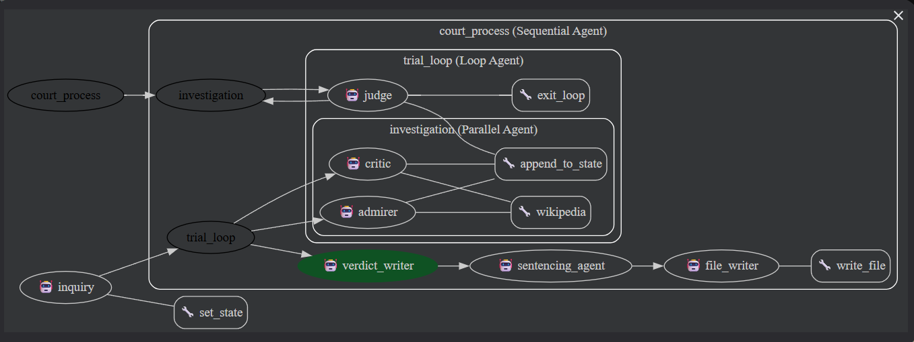

# The Historical Court

The Historical Court is a multi-agent system built with Google ADK.  
It simulates an international tribunal to analyze a historical figure or event using adversarial investigation, judicial review, and structured legal reporting.

The system produces a formal A4-style legal opinion including international law qualification and hypothetical sentencing.

---

## 1. Project Objective

This project demonstrates:

- Multi-Agent architecture design using Google ADK
- Parallel evidence gathering (positive vs negative)
- Judicial supervision with controlled loop termination
- Structured legal reasoning output
- Deterministic execution with reproducible results

The goal is to evaluate historical topics in a balanced and structured manner.

---

## 2. Agent Architecture

The system is composed of the following agents:

### 1. inquiry (Root Agent)
- Receives topic from user
- Stores topic in session state
- Transfers control to `court_process`

### 2. court_process (SequentialAgent)
Controls execution order:
1. trial_loop  
2. verdict_writer  
3. sentencing_agent  
4. file_writer  

Ensures deterministic stage progression.

---

### 3. trial_loop (LoopAgent)

Runs investigation and judicial evaluation repeatedly until evidence is sufficient.

Contains:
- investigation (ParallelAgent)
- judge (termination authority)

Loop termination is allowed **only via `exit_loop` tool**.

---

### 4. investigation (ParallelAgent)

Runs two agents simultaneously:

#### admirer (Defense)
- Collects positive achievements
- Writes to `pos_data`

#### critic (Prosecution)
- Collects negative findings or controversies
- Writes to `neg_data`

Parallel execution reduces bias and prevents sequential influence.

---

### 5. judge

- Evaluates balance between `pos_data` and `neg_data`
- Orders further research if insufficient
- Writes neutral analysis to `verdict`
- Must call `exit_loop` to end loop

---

### 6. verdict_writer

Generates structured legal opinion:

I. Background  
II. Issues  
III. Positive Findings  
IV. Negative Findings  
V. Legal Analysis  
VI. Verdict  

---

### 7. sentencing_agent

Applies international criminal law frameworks:

- Rome Statute
- Geneva Conventions
- Crimes Against Humanity
- Genocide
- War Crimes
- Crime of Aggression

Produces:

VII. International Legal Qualification  
VIII. Hypothetical Sentencing Outcome  

---

### 8. file_writer

Formats and saves the final A4-style report into:

historical_reports/<TOPIC>_Court_Report.txt


---

## 3. State Management

The system uses explicit session state keys:

| Key | Purpose |
|------|----------|
| topic | User input |
| pos_data | Positive findings |
| neg_data | Negative findings |
| verdict | Judge analysis |
| verdict_body | Sections I–VI |
| sentencing_body | Sections VII–VIII |

Design principles:

- Single-owner write access
- Append-only for research data
- Deterministic state propagation
- No cross-agent mutation

---

## 4. Output Structure

Each execution produces a structured tribunal-style document:


THE HISTORICAL COURT
INTERNATIONAL TRIBUNAL DIVISION

I. BACKGROUND
II. ISSUES FOR DETERMINATION
III. FINDINGS OF FACT (POSITIVE)
IV. FINDINGS OF FACT (NEGATIVE)
V. LEGAL ANALYSIS
VI. VERDICT
VII. INTERNATIONAL LEGAL QUALIFICATION
VIII. HYPOTHETICAL SENTENCING OUTCOME


The output is:

- Balanced
- Legally structured
- Deterministic
- Based strictly on collected evidence

---

## 5. Technical Design Principles

This project demonstrates:

### Multi-Agent Orchestration
- Root → Sequential → Loop → Parallel → Composition

### Deterministic Loop Control
- Loop terminates only via `exit_loop`
- No natural-language termination allowed

### Parallel Adversarial Modeling
- Defense and Prosecution operate independently
- Prevents bias

### Tool Restriction (Anti-Hallucination)
- Explicit tool whitelist
- No delegation
- temperature=0 for reproducibility

### Clean Responsibility Separation
Each agent has a single responsibility:
- Research
- Evaluation
- Drafting
- Legal qualification
- File output

---

## 6. How to Run

Install dependencies:

```bash
pip install google-adk python-dotenv google-cloud-logging langchain-community wikipedia


Create .env:

MODEL=gemini-2.5-flash
GOOGLE_API_KEY=your_api_key


Run:

adk run TheHistoricalCourt


Or Web UI:

adk web TheHistoricalCourt
